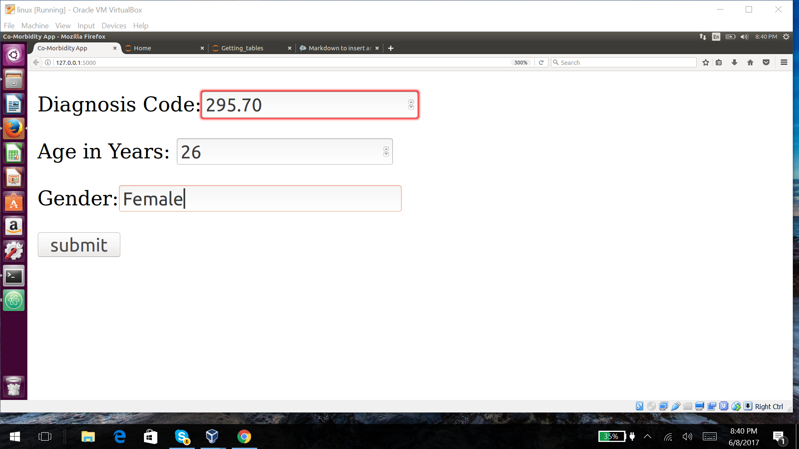
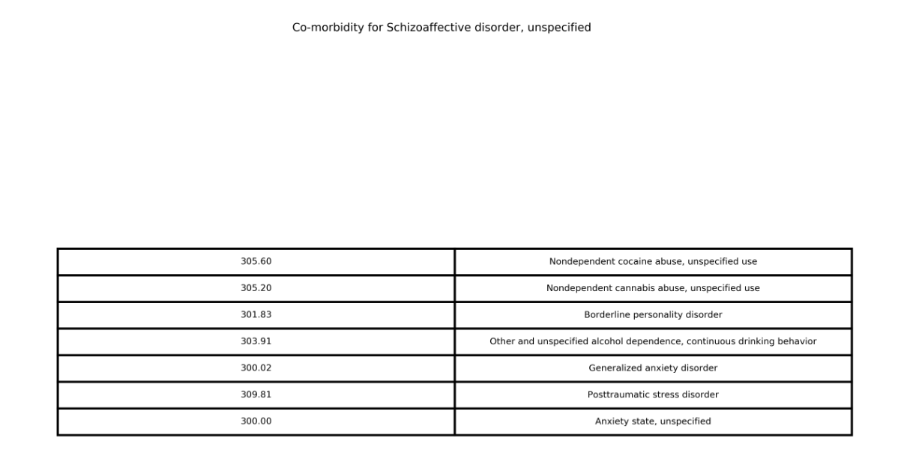
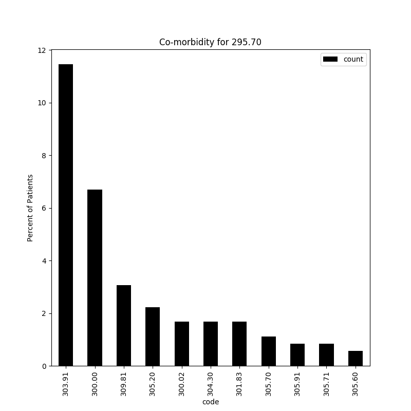
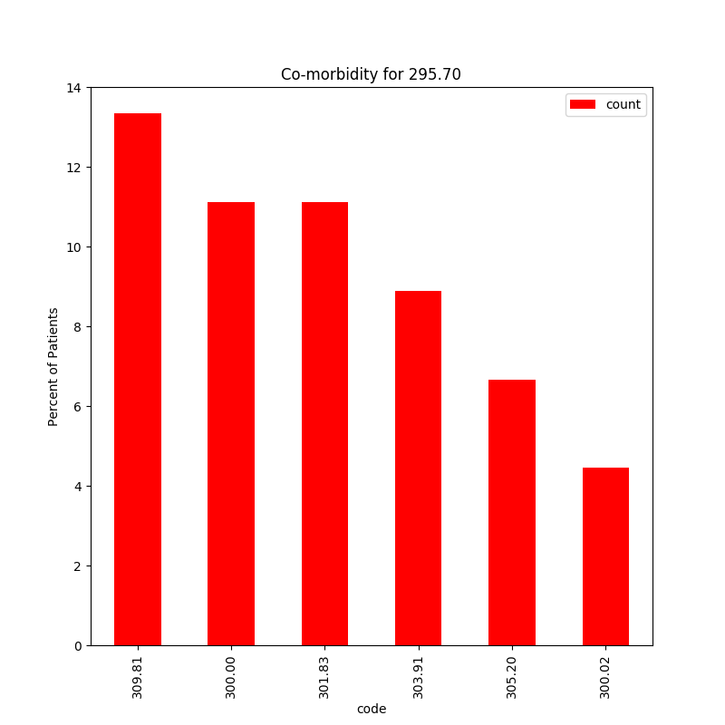
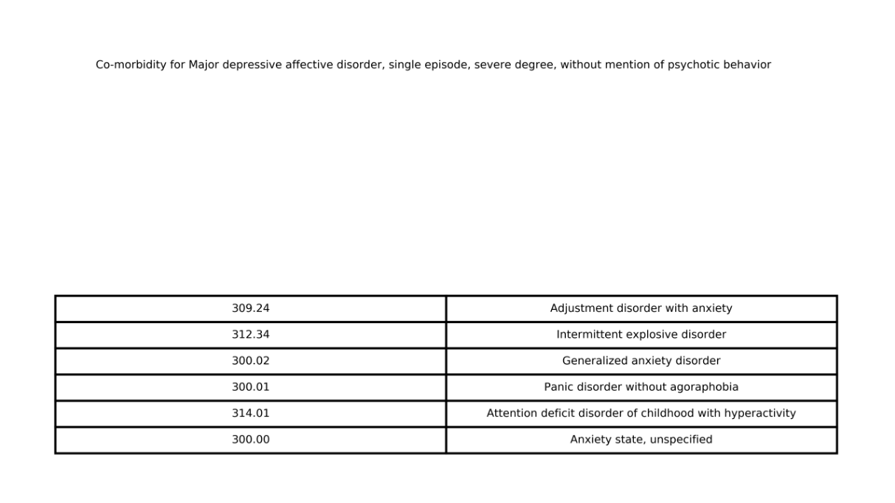
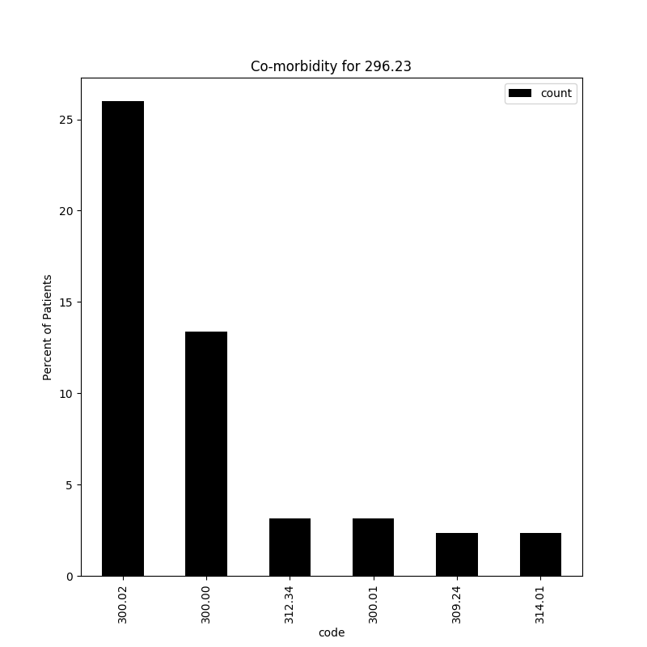

# Example of Web App with a user being a 26 year old female

Enter in information

Get Co-morbidity table information

Get graphs related to code imputed

Get graphs related to personal information inputed

Another Example

