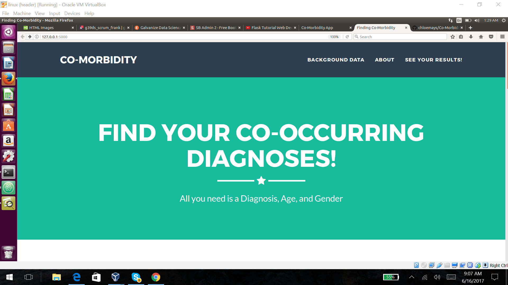
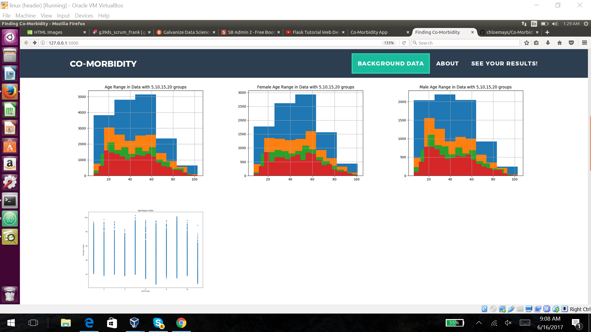
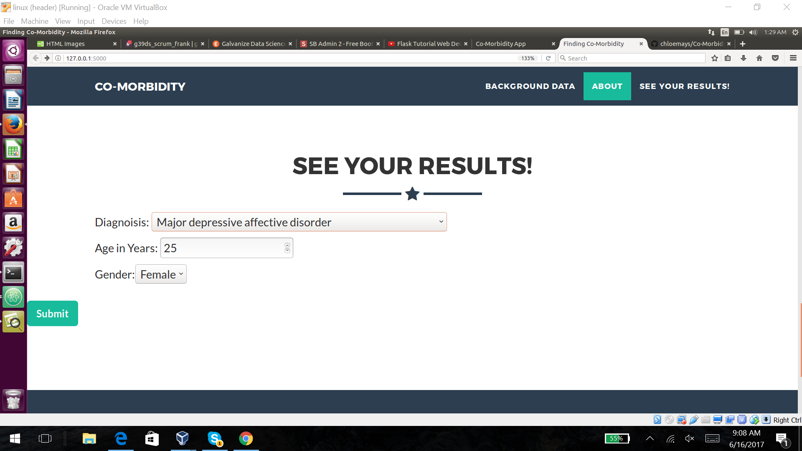
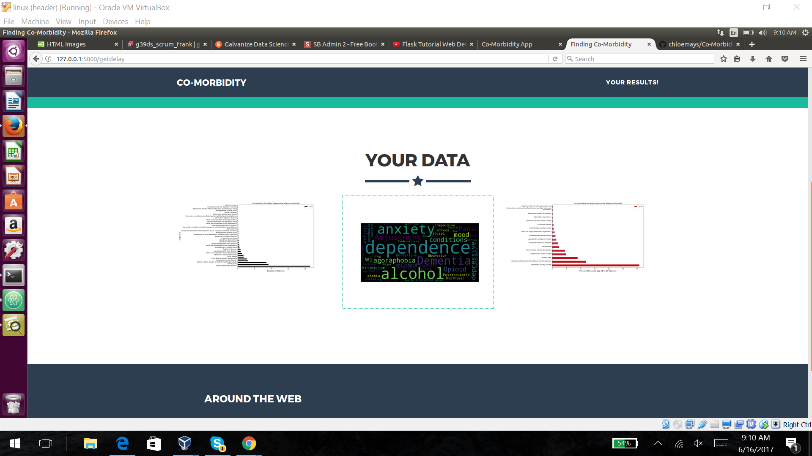
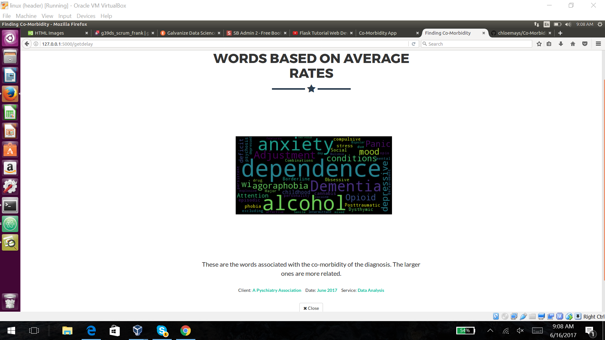

# Co-Morbidity

capstone project

## Goal:

To help people see that given they have a certain health problem what is the likelihood of having other health problems that are co-morbid (co-occurring) in the psychiatry field. Using this they can double check with their doctor if they have checked for those other disorders. The reason I wanted to do psychiatry is because these diagnosis are especially related to a doctors discretion. I wanted to display this in an easy to read format that covers a broad scope of psychiatric diagnosis because normally studies are done with very specific co-morbidity in mind.

Another application is determining if doctors are within the range of national percent of people having these co-morbid diseases. To make sure the doctors are being thorough with their process.

## Data:

The information I am using has 19,830 individuals in 6 months of data with 11 different doctors that go to several hospitals. There are 154 different symptoms and disorders that I have to compare.

I chose to separate by gender and age by groups of 20. I chose groups of 20 years so make sure it still has a good number of patients for each group. And in the bar graphs I discard any co-morbid diagnosis that have 1 or less patients with it.

In my web app I display histograms of the distributions of age and gender by age. Also, not all doctors see every age group so I chose to display a scatter plot as well on that.

## Visualization:

I made a web app to be able to display graphs based on personal information entered. And currently using bar graphs and word clouds.

The first page has a header for my topic

Then you can look at the background information giving more context to the data displayed later.

The best part! Entering your information!

Then it displays an overhead look at your results

Every image can be liked on for a closer look and more descriptive information

## Research:

Paper on Co-Morbidity of mental disorders and medical ones
http://www.integration.samhsa.gov/workforce/mental_disorders_and_medical_comorbidity.pdf

website with links to helpful psychology information
http://www.apa.org/helpcenter/data-behavioral-health.aspx

https://en.wikipedia.org/wiki/DSM-5

http://jamanetwork.com/journals/jamapsychiatry/fullarticle/208029

Co-morbidity app
https://www.ncbi.nlm.nih.gov/pmc/articles/PMC4380025/
