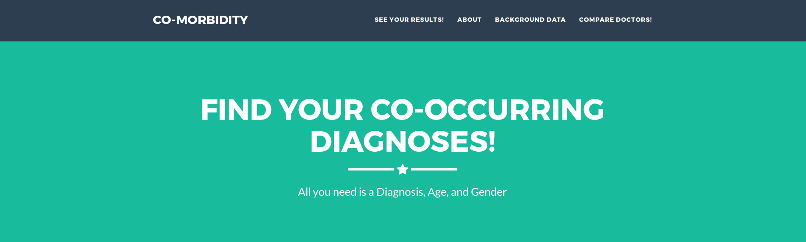
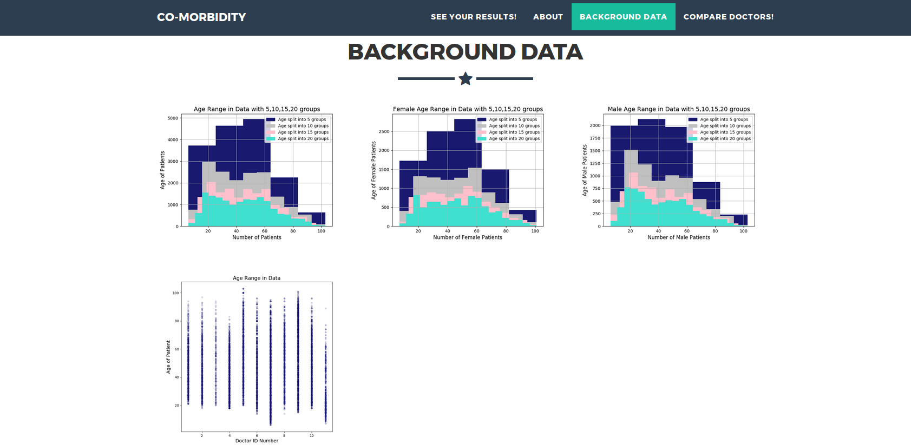
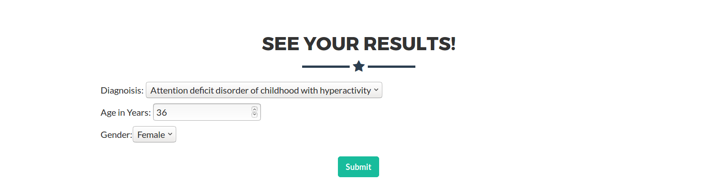
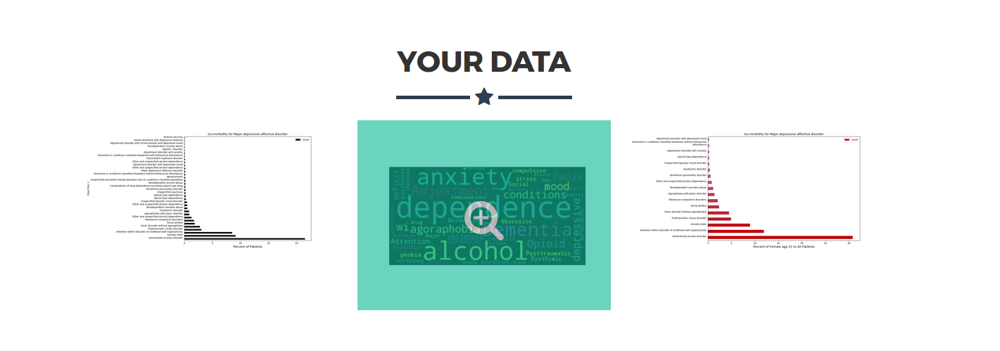
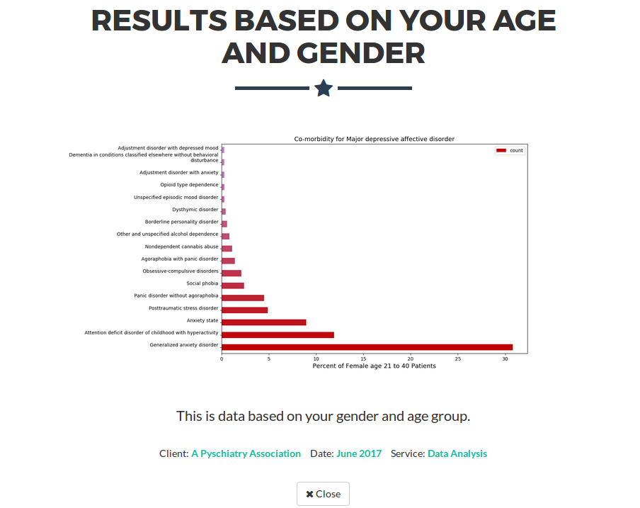
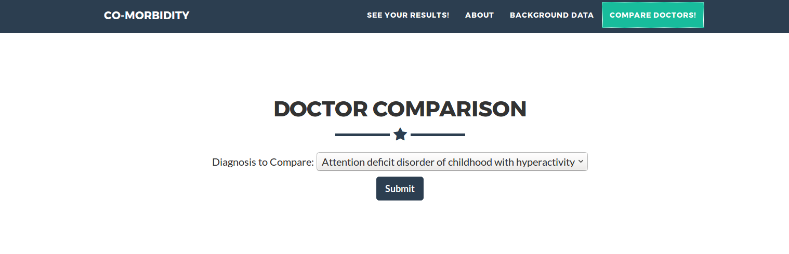
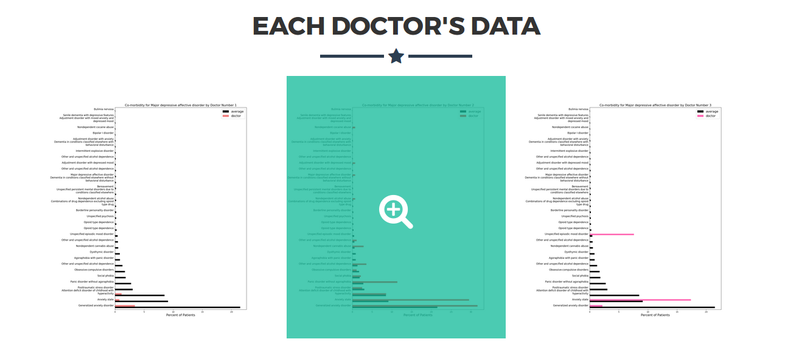

# Co-Morbidity

capstone project

## My website

http://ec2-34-226-42-52.compute-1.amazonaws.com:8105/

## Goal:

To help people see that given they have a certain health problem what is the likelihood of having other health problems that are co-morbid (co-occurring) in the psychiatry field. Using this they can double check with their doctor if they have checked for those other disorders. The reason I wanted to do psychiatry is because these diagnosis are especially related to a doctors discretion. I wanted to display this in an easy to read format that covers a broad scope of psychiatric diagnosis because normally studies are done with very specific co-morbidity in mind.

Another application is comparing doctors rates of diagnosing co-morbidity and comparing it to the average. To make sure the doctors are being thorough with their process.

## Raw Data Background:

The information I am using has 19,830 individuals in 6 months of data with 11 different doctors that go to several hospitals. There are 125 different symptoms and disorders that I have to compare. All of this data is from patients that have seen a psychiatrist so the interpretation of these results should be the percent of co-occurring diagnosis of patients seeing a psychiatrist.

In my web app I display histograms of the distributions of age and gender by age. Also, not all doctors see every age group so I chose to display a scatter plot as well on that.

## Interpreting/Manipulating Data:

I decided to generalize some of the terms to have more patients to relate to each other. I edited these to combine the mild, moderate, and severe types.

        bipolar 1 codes
        Major Depressive disorder
        Paranoid type schizophrenia
        schizoaffective disorder
        Alcohol disorder to include all levels in one
        cannabus use disorder
        Phencyclidine use disorder
        Nondependent alcohol abuse
        other hallucinogen use disorder
        Opiod use disorder
        Sedative Hypnotic or Anxiolytic use disorder
        stimulant use disorder Amphetamine-type substance/other
        stimulant use disorder cocaine

I separated the data by gender and age by groups of 20. This made sure it still has a good number of patients for each group. And in the bar graphs I discard any co-morbid diagnosis that have 1 or less patients with that feature.

I did not want individuals to be counted more than once so I just chose the most recent visit.

## Visualization:

I made a web app to be able to display graphs based on personal information entered. And currently using bar graphs and word clouds.

The first page has a header for my topic

Then you can look at the background information giving more context to the data displayed later.

The best part! Entering your information!

Then it displays an overhead look at your results

Every image can be liked on for a closer look and more descriptive information.

If you would like too see how each doctor compares in their co-morbid diagnosis you can!

This compares the doctors rates to the average rates of the 11 doctors I had information on.

## My website

http://ec2-34-226-42-52.compute-1.amazonaws.com:8105/

## Research:

Paper on Co-Morbidity of mental disorders and medical ones
http://www.integration.samhsa.gov/workforce/mental_disorders_and_medical_comorbidity.pdf

website with links to helpful psychology information
http://www.apa.org/helpcenter/data-behavioral-health.aspx

https://en.wikipedia.org/wiki/DSM-5

http://jamanetwork.com/journals/jamapsychiatry/fullarticle/208029

Co-morbidity app
https://www.ncbi.nlm.nih.gov/pmc/articles/PMC4380025/
